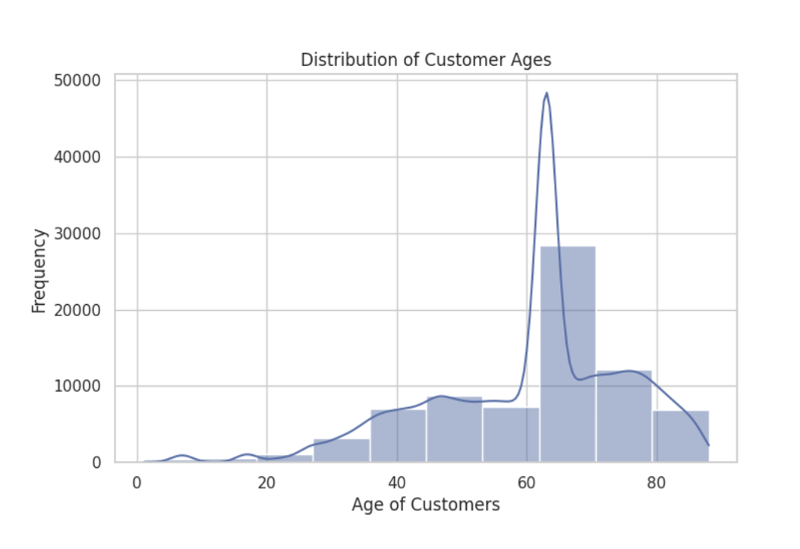
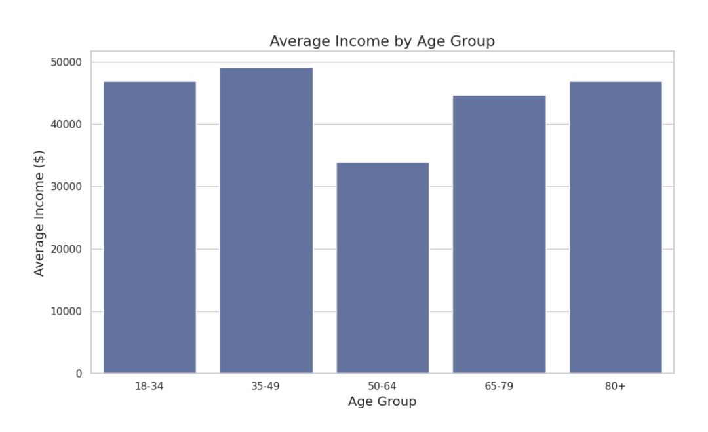
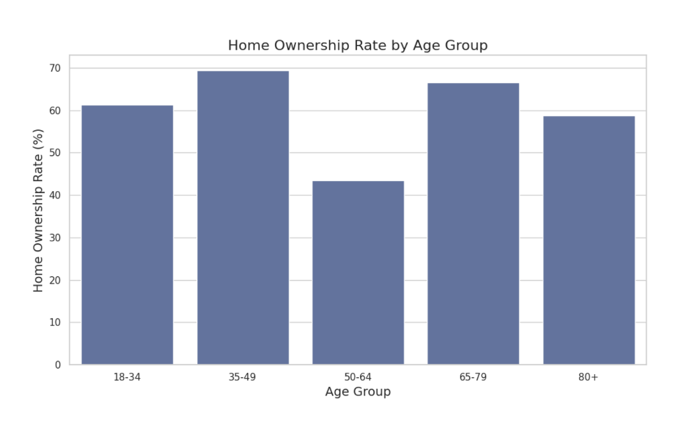
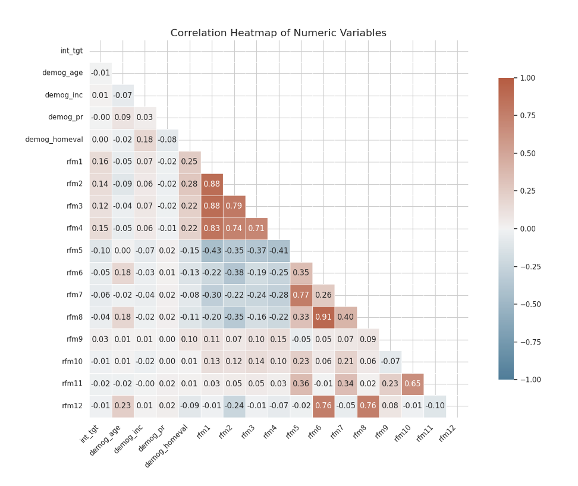
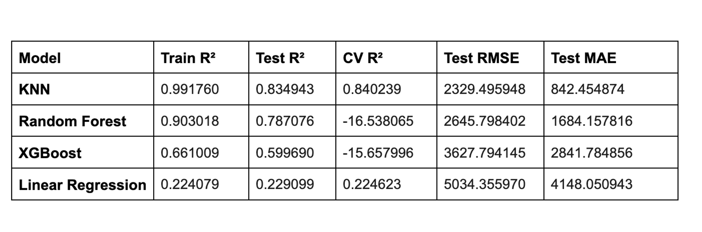
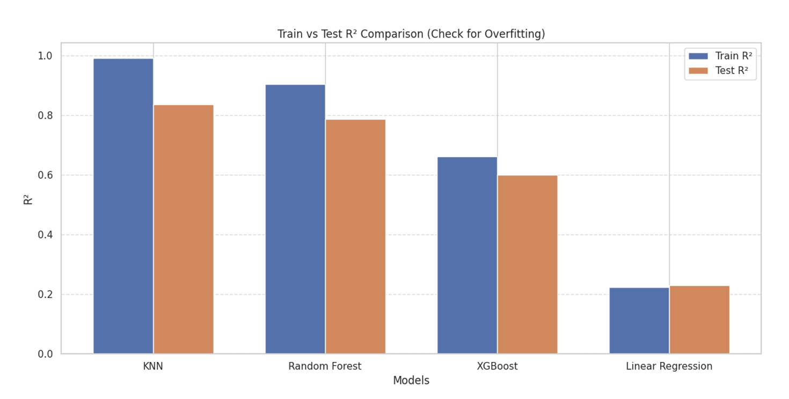

# Bank Data Predictive Analytics Project

## Project Overview
This project focuses on leveraging data analytics to help a banking institution increase sales through predictive modeling. By analyzing customer demographics and behavioral data (RFM - Recency, Frequency, Monetary), the goal was to build a regression model capable of predicting the sales potential of customers.

This analysis allows the bank to identify high-value targets, optimize marketing strategies, and make data-driven decisions to boost revenue.

## Business Understanding
**Goal:** Implement multiple regression models to determine the most accurate predictor for the target variable `int_tgt` (Customer Sales Potential).

**Business Objectives:**
* **Targeting:** Identify which customers are likely to generate higher sales.
* **Strategy:** Suggest strategies to develop specially curated products.
* **Revenue:** Invest limited resources effectively on customers with the highest return potential.

## Data Understanding

### The Dataset
The dataset consists of **127,089 rows** and **20 variables**, including:
* **Target Variable:** `int_tgt` (Sales Potential)
* **Features:**
    * 12 Recency, Frequency, Monetary (RFM) variables.
    * 7 Demographic variables (Customer characteristics like Age, Income, Home Ownership, Gender).

### Data Cleaning & Preparation
To prepare the data for modeling, I addressed several challenges:
* **Inconsistent Data Types:** Converted string values in demographic and monetary fields to appropriate numeric formats.
* **Missing Values:** Applied median imputation strategies for numeric variables such as `demog_age` and `demog_homeval` to maintain data integrity.
* **Outliers:** Used the Interquartile Range (IQR) method to identify and handle outliers that could distort model performance.
* **Binary Variables:** Standardized categorical variables (e.g., Gender, Home Ownership) into numeric binary formats.

### Exploratory Data Analysis (EDA)
I performed EDA to understand distributions and relationships:
* **Distributions:** Analyzed customer age and income distributions.
**EDA: Customer Age Distribution**

* **Relationships:** Investigated the correlation between Age vs. Income and Home Ownership patterns.

**EDA: Age vs. Income Relationship**

**EDA: HOme Ownership Patterns**

* **Correlation Matrix:** Generated a heatmap to identify strong correlations between RFM features and the target variable.

**EDA: Correlation Analysis**

## Modeling and Evaluation
I implemented and compared several regression models to find the best fit for the data:

1.  **Multiple Linear Regression**
2.  **K-Nearest Neighbors (KNN)**
3.  **Random Forest**
4.  **XGBoost**

### Evaluation
The models were evaluated based on **Test R² (Coefficient of Determination)** and **RMSE (Root Mean Squared Error)**.

* **Best Performing Model:** K-Nearest Neighbors (KNN) Regression.
* **Performance:** The KNN model achieved a **Test R² of 0.834**, demonstrating superior predictive capability compared to the other models tested.

**Model Selection and Performance**

## Conclusion
* **Behavioral vs. Demographic:** The analysis revealed that behavioral metrics (RFM) outperform demographic variables in predicting sales potential.
* **Model Selection:** The KNN model was identified as the superior predictor, suggesting that complex, non-linear relationships exist in customer purchasing behavior that linear models might miss.
* **Business Impact:** By utilizing this model, the business can accurately score customers based on their predicted sales potential, allowing for more precise marketing targeting and improved resource allocation.

---
*This project was completed as part of a school data analysis curriculum.*